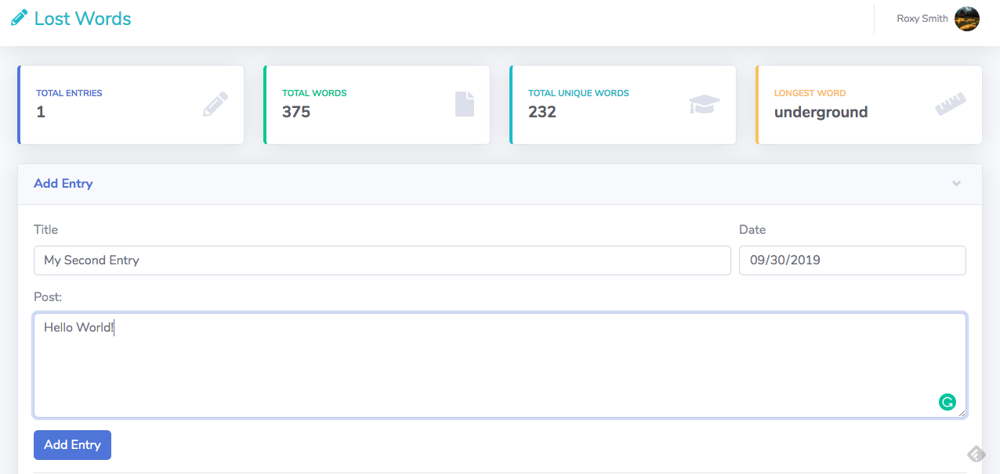
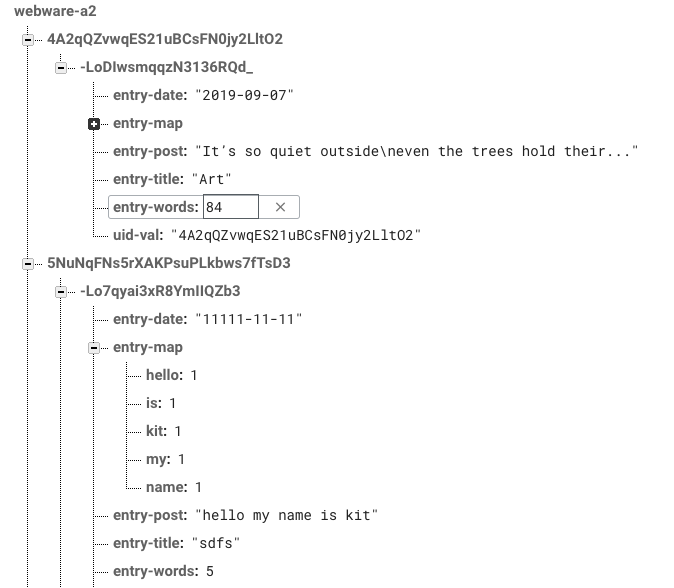
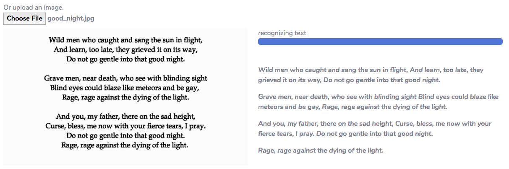

## Lost Words

Lost words is a web app that allows users to make a account and store writing entries. The app
will give user feedback, such as word frequency, synonyms and rhyming words, as well as tools for
searching for definitions. A writer's toolkit in attempt to never be lost for words!

http://a2-kitzeller.glitch.me

Here is a sample formula for summarizing your activities, talk about:
- the domain area the project pertains to
- the main challenges or problems the application addresses
- the key innovations that make it possible to address the problem
- the main results of the implementation, does it really address the problem?
- any additional implications of the resulting application, or possibly areas for future work that have been discovered as part of the design and implementation activities

(Note that when I use the above formula, I aim to have only one sentence per thought in order to remain concise.)

Below is the top of the UI for the main dashboard which makes up most of the app's components.

Below is a snippet of the firebase layout

Below is an example of hovering over a word in the bubble chart.

Below is an example of OCR recognition for post submission.

## Technical Achievements
- **Tech Achievement 1**: Used Firebase Admin SDK for database access through the server. In the handle get/post/delete/put requests,
the data gets sent/retrieve from a cloud database as a means of persistent storage. I designed the database so that each unique UID associated with the logged in user is
used to get only their data from the database. The server calculates the word count and frequency map before posting it to the database.
- **Tech Achievement 2**: Implemented a user authentication system using firebase auth client library. Authentication is checked
and access to personal dashboard sites is dependent on being authenticated. Created login and register pages for this.
- **Tech Achievement 3**: Using d3.js, created visualizations. Used chart.js too.
- **Tech Achievement 4**: Using http requests to the datamuse api, get word synonym data.
- **Tech Achievement 5**: Used angular.js for better dynamic generation
- **Tech Achievement 6**: Use tesseract.js and myscript.js for OCR and handwriting recognition

### Design/Evaluation Achievements
- **Design Achievement 1**: Used and modified a bootstrap admin theme from [here](https://startbootstrap.com/themes/sb-admin-2/)
- **Design Achievement 2**: Designed the data visualizations and the interaction for submitting new posts
- **Design Achievement 3**: Came up with the idea
- **Design Achievement 4**: Collapsible cards

