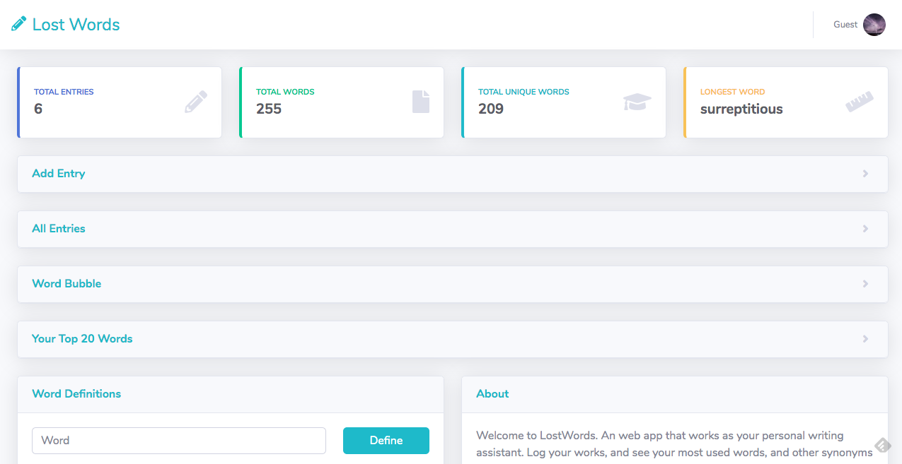
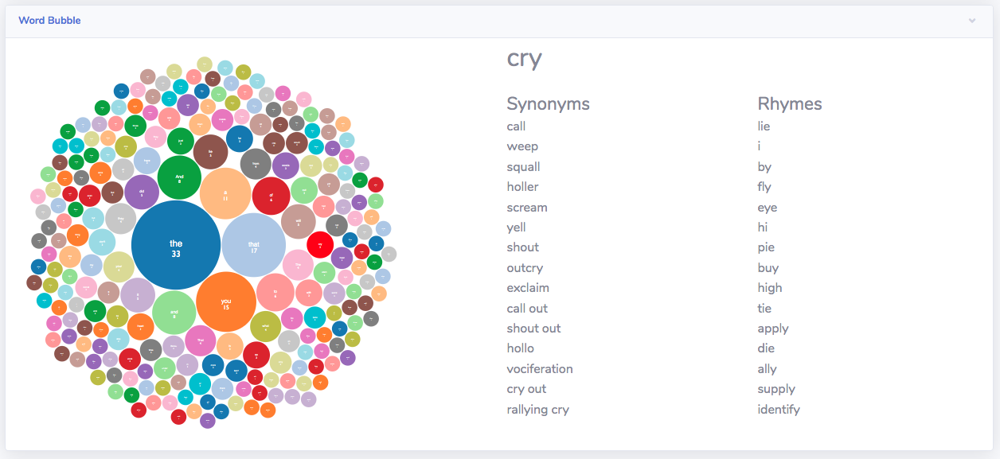

## Lost Words

Lost words is a web app that allows users to make an account and store writing entries. The app
gives user feedback, such as word frequency, synonyms and rhyming words, as well as tools for
searching for word definitions. It is meant to be a writer's toolkit and ensure that words are never lost, made possible by
cloud database storage, text recognition libraries, and various UI elements. Hopefully, this app allows users to 
be more aware of their writing and the words they use.

Future work could include text classification, such as active/passive voice, spelling mistakes, and grammatical structure.
There is also the possibility for implementing group collaboration, such as for co-authoring.

http://a2-kitzeller.glitch.me

Below is the top of the UI for the main dashboard which makes up most of the app's components. The cards are open on window load, but I have collapsed them in this screenshot.

Below is a snippet of the firebase layout

Below is an example of hovering over a word in the bubble chart.

Below is an example of OCR recognition for post submission.

## Technical Achievements
- **Tech Achievement 1**: I used Firebase Admin SDK for database access through the server. In the handle get/post/delete/put requests,
the data gets sent/retrieved from a cloud database as a means of persistent storage. I designed the database so that each unique UID associated with the logged in user is
used to get only their data from the database. The server calculates the word count and frequency map before posting it to the database.
- **Tech Achievement 2**: I implemented a user authentication system using firebase auth client library. Authentication is checked
and access to personal dashboard sites is dependent on being authenticated. I adapted login/register pages from a bootstrap template.
- **Tech Achievement 3**: Using d3.js I created a bubble chart for displaying word frequency. I also used chart.js to make the top 10 word bar chart.
- **Tech Achievement 4**: I made http requests to the [datamuse](https://www.datamuse.com/api/) API in order to get word synonym data and integrate it with other features on the site, like on-hover actions over bubble chart nodes.
- **Tech Achievement 5**: I used Angular.js for better dynamic content generation of the website.
- **Tech Achievement 6**: I used Tesseract.js and MyScript.js for OCR and handwriting recognition.

### Design/Evaluation Achievements
- **Design Achievement 1**: I used and modified a bootstrap admin theme from [here](https://startbootstrap.com/themes/sb-admin-2/). 
Modifications were made within the html files as well as custom overrides in styles.css.    
- **Design Achievement 2**: I designed all of the individual card content, like data visualizations and the interaction for submitting new posts, as well as which information
to show on the top cards.
- **Design Achievement 3**: I designed multiple text entry methods for accessibility: file upload OCR recognition, realtime handwriting recognition, typing.
- **Design Achievement 4**: I paid attention to minor detail. For instance, "no results" message on definition searches. 
Alert messages for form validation. Collapsible cards. Only enabling delete/update buttons when a table row is selected. 
Re-disabling the delete/update buttons when a row is deleted.
- **Design Achievement 5**: I make use of external libraries to improve design and code clarity. For instance, I used jQuery for CSS selection (element, id, class) as part of the homework requirement. 
I also used the DataTables library for a nicer looking table as well as Angular.js for dynamic content generation and styling conditions as "ng-if" statements in the html tags.

